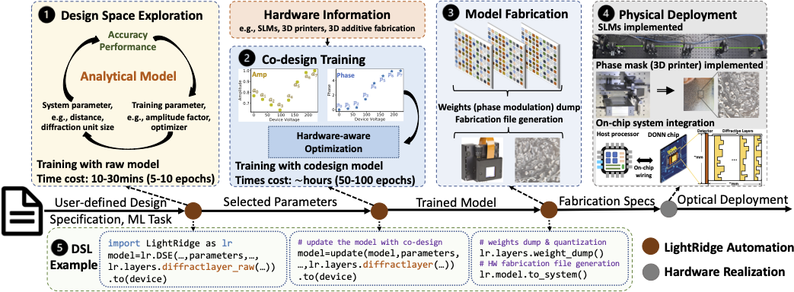
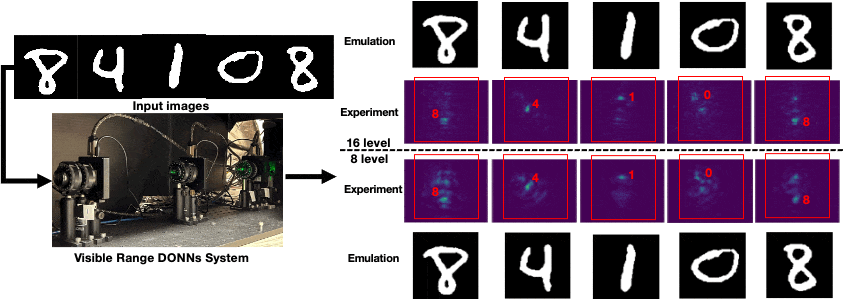

.. Read the Docs Template documentation master file, created by
   sphinx-quickstart on Tue Aug 26 14:19:49 2014.
   You can adapt this file completely to your liking, but it should at least
   contain the root `toctree` directive.

Welcome to LightRidge — An Open-Source Hardware Project for Optical AI!
==================================================

Contact: `Yingjie Li <https://lyj1201.github.io/yingjieli/>`_  (yingjie.li@utah.edu), `Cunxi Yu <http://ycunxi.github.io/cunxiyu/>`_ (cunxi.yu@utah.edu)

Getting Started
---------------

.. toctree::
   :maxdepth: 1

   installation
   samples
   tutorials
   pythonapi
   lightridge_tutorial_ASPLOS23_AE 
 

LightRidge Design Flow
-------------

LightRidge is an open-source framework for end-to-end optical machine learning (ML) compilation, which connects **physics to system**. It is specifically designed for diffractive optical computing, offering a comprehensive set of features (Check out our `ASPLOS’24 paper <https://arxiv.org/pdf/2306.11268.pdf>`_ for details):

.. raw:: html

     

- Precise and differentiable optical physics kernels: LightRidge empowers researchers and developers to explore and optimize diffractive optical neural network (DONN) architectures. With built-in, accurate, and differentiable optical physics kernels, users can achieve complete and detailed analyses of DONN performance.

- Accelerated optical physics computation kernel: LightRidge incorporates high-performance computation kernels, resulting in significant runtime reductions during training, emulation, and deployment of DONNs. This acceleration streamlines the development process and boosts the efficiency of optical ML workflows.

- Versatile and flexible optical system modeling: LightRidge provides a rich set of tools for modeling and simulating optical systems. Researchers can create complex optical setups, simulate light propagation, and analyze system behavior using LightRidge's versatile capabilities.

- User-friendly domain-specific language (DSL): LightRidge includes a user-friendly DSL, enabling users to describe and configure diffractive optical networks easily. The DSL simplifies the implementation process and facilitates rapid prototyping of novel optical ML models.
 

LightRidge DONNs Design Showcase 
-------------

**Case study 1 -- Visible Range Codesign on MNIST-10 [1][3][5]** 
 

Link to Code Example: `Code Example <https://lightridge.github.io/lightridge/tutorials/tutorial_01_d2nn_training.html>`_.

.. code-block:: python

   class DONNs_Classifier(torch.nn.Module):
    def __init__(self, phase_func, intensity_func, device, det_x_loc, det_y_loc,
    det_size, wavelength=5.32e-7, pixel_size=0.000036, batch_norm=False, sys_size = 200, pad = 100,
    distance=0.1, num_layers=2, precision=256, amp_factor=6, approx="Fresnel"):
        super(DiffractiveClassifier_CoDesign, self).__init__()
        self.amp_factor = amp_factor
        self.size = sys_size
        self.distance = distance
        self.wavelength = wavelength
        self.pixel_size = pixel_size
        self.pad = pad
        self.approx=approx
        self.det_size = det_size
        self.phase_func = phase_func.to(device)
        self.intensity_func = intensity_func.to(device)
        self.approx=approx
        self.diffractive_layers = torch.nn.ModuleList([layers.DiffractiveLayer(
        self.phase_func, self.intensity_func, wavelength=self.wavelength, pixel_size=self.pixel_size,
                size=self.size,pad = self.pad, distance=self.distance, amplitude_factor = amp_factor, approx=self.approx, phase_mod=True)
                for _ in range(num_layers)])
        self.last_diffraction = layers.DiffractiveLayer(None, None, wavelength=self.wavelength, pixel_size=self.pixel_size,
                size=self.size, pad = self.pad, distance=self.distance, approx=self.approx, phase_mod=False)

**Case study 2 -- Multi-task Learning in DONNs [2][4]**
 
.. image:: showcase.gif
  :alt: image for slm vs mp
  :width: 450

References
-------------

[1] Li, Yingjie, Ruiyang Chen, Weilu Gao, and Cunxi Yu. "Physics-aware Differentiable Discrete Codesign for Diffractive Optical Neural Networks." In Proceedings of the 41st IEEE/ACM International Conference on Computer-Aided Design (ICCAD’22), pp. 1-9. 2022.

[2] Li, Yingjie, Ruiyang Chen, Berardi Sensale-Rodriguez, Weilu Gao, and Cunxi Yu. "Real-time multi-task diffractive deep neural networks via hardware-software co-design." Scientific reports 11, no. 1 (2021): 11013.

[3] Ruiyang Chen*, Yingjie Li*(equal contribution), Minhan Lou, Jichao Fan, Yingheng Tang, Berardi Sensale-Rodriguez, Cunxi Yu, and Weilu Gao. "Physics-aware Complex-valued Adversarial Machine Learning in Reconfigurable Diffractive All-optical Neural Network." 
Laser & Photonics Reviews. Vol 16, July 2022.

[4] Li, Yingjie, Weilu Gao, and Cunxi Yu. "Rubik's Optical Neural Networks: Multi-task Learning with Physics-aware Rotation Architecture.”. International Joint Conference on Artificial Intelligence (IJCAI’23) (15%). 2023.

[5] Li, Yingjie, Ruiyang Chen, Minhan Lou, Berardi Sensale-Rodriguez, Weilu Gao, and Cunxi Yu. "LightRidge: An End-to-end Agile Design Framework for Diffractive Optical Neural Networks." ACM International Conference on Architectural Support for Programming Languages and Operating Systems (ASPLOS’24).
 

